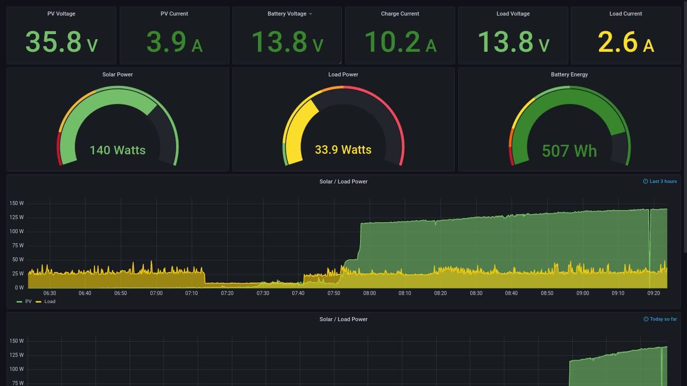

### TIG Stack on Raspberry Pi for Solar Dashboard

**TIG** is the Telegraf, Influxdb, Grafana set of tools.

  Telegraf collects data from various sources. In my case from a cheap $2 RS-485-USB adapter available from AliExpress or eBay. This interfaces to my Epever Tracer 3210AN solar charge controller. The Tracer is an MPPT controller that can accpet PV input up to 100V and "buck convert" it down to match a 12V / 24V battery system. It has a good set of measured voltage, current and power values that it can provide via an RS-485 Modbus interface. This data is collected by Telegraf and stored in the Influxdb.
  
  Influx is a database system - optimized for storing time series data and querying it in various time related ways.
  
  Grafana is a visual web panel development tool. It can be used to easily create web dashboards with various gauges and graphs. 
  
This repo is a collection of various config and script files that tie my dashboard together and make it work. It assumes you have a basic install of the TIG stack. There are many tutorials around the web for getting that part done. Here are a couple I referred to when setting this up:

  https://nwmichl.net/2020/07/14/telegraf-influxdb-grafana-on-raspberrypi-from-scratch/
  
  https://simonhearne.com/2020/pi-influx-grafana/
  
All were useful and I'm not sure which I followed most in the end. It's all typical install-on-linux type stuff.

In addition to the TIG stack I found, modified and installed an Epever modbus telegraf input plugin conf file (epever_modbus.conf). I altered it to have short names for the measurements and for my specific USB adapter. There are also some changes to the default telegraf.conf so that system inputs aren't collected as much and some of my own logging choices etc.

You will need a RS-485-USB adapter to get data from controller to raspi. 

### Steps to Install the Dashboard

1. Follow a tutorial above to get Telegraf, Influxdb and Grafana installed and running. I assume that part is done and each is running as it's own user with systemd services enabled so they start at boot.

2. Copy epever_modbus.conf to the /etc/telegraf.d/ directory

3. Edit or copy over telegraf.conf and telegraf.service so it starts with correct config and config directory. You may want to edit the conf file to suit or just merge in differences accordingly. Restart telegraf.

4. Edit or copy over grafini.ini to /etc/grafini/ - note I have enabled serve_from_sub_path option but you may not need it. The other change is csv plugin at bottom with allow_local_mode = true. 

5. Create a database in influx called solar, or you can just use the default but will need to edit the dashboard data source to match.

6. On Grafana dashboard click "plus" menu item and select "Import". It allows for uploading a new dashboard. Choose the "solar.json" file here and import it. 

7. Also in Grafana, click "Server Admin" menu, "Plugins" and search for and install the CSV plugin. This is used for the battery level gauge workaround as described below.

8. Copy the `lastfull` script over to `/usr/local/bin/lastfull` and be sure to "chmod +x" the file.

9. Install the cronjob: `sudo crontab -e` and append line from `cronjob` file here. You can alter the time schedule as you please, though I'd suggest either every hour, or once a day after you expect battery to be fully charged. See battery gauge info below about how this works.

10. Test it out and see if it works. 

### Battery Energy Gauge - (Coulomb counter style indicator)

In addition to some pretty typical Grafana gauges and charts I also put together an energy gauge that was a bit more involved, but gives  better indication of batery level than simple voltage based ones. Due to some limits on getting timestamps from an Influx subquery I figured out a workaround using the Grafana csv data source plugin, and a cronjob with simple script to pull and save the most recent time the battery was FULL. I'll add details on how this works here.

TODO...
  
### Bonus - Solar Tunnel - Optional

  (for viewing dashboard via remote server)

TODO...
