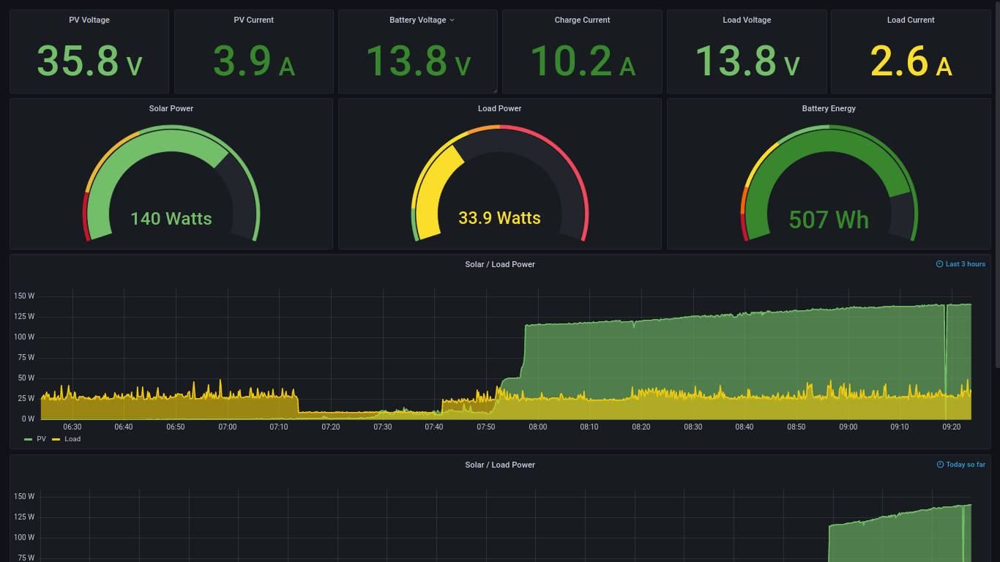
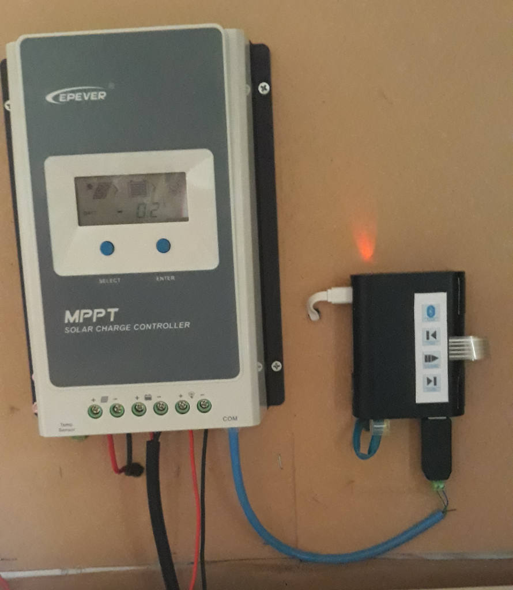

### TIG Stack on Raspberry Pi for Solar Dashboard

**TIG** is the Telegraf, Influxdb, Grafana set of tools.

  **Telegraf** collects data from various sources. In my case from a cheap $2 RS-485-USB adapter available from AliExpress or eBay. This interfaces to my Epever Tracer 3210AN solar charge controller. The Tracer is an MPPT controller that can accpet PV input up to 100V and "buck convert" it down to match a 12V / 24V battery system. It has a good set of measured voltage, current and power values that it can provide via an RS-485 Modbus interface. This data is collected by Telegraf and stored in the Influxdb.
  
  **Influx** is a database system - optimized for storing time series data and querying it in various time related ways.
  
  **Grafana** is a visual web panel development tool. It can be used to easily create web dashboards with various gauges and graphs. 
  
This repo is a collection of various config and script files that tie my dashboard together and make it work. It assumes you have a basic install of the TIG stack. There are many tutorials around the web for getting that part done. Here are a couple I referred to when setting this up:

  https://nwmichl.net/2020/07/14/telegraf-influxdb-grafana-on-raspberrypi-from-scratch/
  
  https://simonhearne.com/2020/pi-influx-grafana/
  
These were useful and I'm not sure which I followed most in the end. It's typical install-on-linux type stuff.

In addition to the TIG stack I found, modified and installed an Epever modbus telegraf input plugin conf file (epever_modbus.conf). I altered it to have short names for the measurements and for my specific USB adapter. There are also some changes to the default telegraf.conf so that system inputs aren't collected as much and some of my own logging choices etc.

You will need a RS-485-USB adapter to get data from controller to raspi. Here's a pic of my connection between charger and raspi. 

(pay no attention to small key pad  - that is for bluetooth music player using mocp sharing same raspi)

### Steps to Install the Dashboard

1. Follow a tutorial above to get Telegraf, Influxdb and Grafana installed and running. I assume that part is done and each is running as it's own user with systemd services enabled so they start at boot.

2. Copy epever_modbus.conf to the /etc/telegraf.d/ directory. Edit the file to have correct serial tty port and settings.

3. Edit or copy over telegraf.conf and telegraf.service so it starts with correct config and config directory. You may want to edit the conf file to suit or just merge in differences accordingly. Restart telegraf.

4. Edit or copy over grafana.ini to /etc/grafana/ - note I have enabled serve_from_sub_path option but you may not need it. The other change is csv plugin at bottom with allow_local_mode = true. Restart grafana-server.

5. Create a database in influx called solar, or you can just use the default but will need to edit the dashboard data source to match.

6. On Grafana dashboard click "plus" menu item and select "Import". It allows for uploading a new dashboard. Choose the "solar.json" file here and import it. 

7. Open the dashboard settings (gear icon), click Variables, and click the FullBatteryWh variable and set the Watt-hour full capacity of your battery system. Also, click "Server Admin" menu, "Plugins" and search for and install the CSV plugin. Both of these are used for the battery level gauge workaround as described below.

8. Copy the `lastfull` script over to `/usr/local/bin/lastfull` and be sure to "chmod +x" the file.

9. Install the cronjob: `sudo crontab -e` and append line from `cronjob` file here. You can alter the time schedule as you please, though I'd suggest either every hour, or once a day after you expect battery to be fully charged. See battery gauge info below about how this works.

10. Test it out and see if it works. If the dashboard is not getting data then go to the console and check /var/log/telegraf/telegraf.log (or your system log if not overridden in the conf). See if telegraf reports errors on modbus input. You may need to resolve serial-usb issues in that case. Be sure the correct ttyUSB is set in epever_modbus.conf above.

### Battery Energy Gauge (coulomb counter style indicator)

In addition to some pretty typical Grafana gauges and charts I also put together an energy gauge that is a bit more involved, but gives  better indication of battery level than simple voltage based ones. Due to some limits on getting timestamps from an Influx subquery I figured out a workaround using the Grafana csv data source plugin, and a cronjob with simple script to pull and save the most recent time the battery was FULL. Here is how this works in case you need to alter it.

The Battery Level gauge has a influx query as follows:

    select sum("BE")-sum("LE")+$FullBatteryWh from (select integral(B_P)/3600 as "BE",integral(L_P)/3600 as "LE" from modbus where time >= $lastfull and time <= now() group by time(1m))
    
This sums up the power in (from B_P integrated as BE) and subtracts the power out (from L_P integrated as LE) over a time range. The range  starts from the last known time when the battery was full. I couldn't find a way to get the timestamp from a subquery so I did that externally. I have a cronjob which periodically checks the last time battery was full and stores it as csv data (in /var/lib/grafana/csv/solarvars). The timestamp is picked up from csv file and put in the $lastfull variable, which becomes the "from" in a time range of the query.

The lastfull bash script simply does a cli query of influx which returns csv format data, as follows:

    #!/bin/bash

    sudo -u grafana influx -database solar -execute "select last(B_V) from modbus where B_V >= 14.5" -format csv | sudo -u grafana tee /var/lib/grafana/csv/solarvars >/dev/null

This script is run periodically by a cronjob to ensure the sum of power in/out does not drift too far due to accumlated measurement errors.

As can be seen I use a battery voltage of 14.5 (LiFePO4) to indicate FULL, but you could alter the query for a differrent voltage (depends on type of battery) or other criteria. This is a simple test which has been working ok for me.
  
### Bonus - Solar Tunnel - Optional

  (for viewing dashboard via remote server)

This is an extra I needed because I wanted to view my dashboard externally on another server without opening my raspberry pi to the world. I do this using a secure reverse tunnel created by ssh. The solartunnel.service file opens a tunnel to a given IP (a system you must have login access to and preferably set up with key auth, avoiding passwords). It uses autossh to monitor and maintain a more robust tunnel. Follow these extra steps if this is useful for you.

1. Install autossh:  `sudo apt install autossh`.

2. Copy the `solartunnel.service` to the `/lib/systemd/system` directory and edit it to have desired remote and local ports, and suitable user@host values. You probably need to enable GatewayPorts on the remote host system (set in `/etc/ssh/sshd_config`) to allow the tunnel to work. Enable the service: `sudo systemctl enable solartunnel` and try it `sudo systemctl start solartunnel`. You can check status or use `sudo netstat -lntp` to see if the port is listening on remote host.

3. Append, or integrate as suitable, the example reverse proxy lines given in `nginx-proxy.conf`. Obviously this will depend on how you embed the dashboard into an existing web server config but these lines are the basics of what you would add on.

4. Test the dashboard viewable via your remote server.
